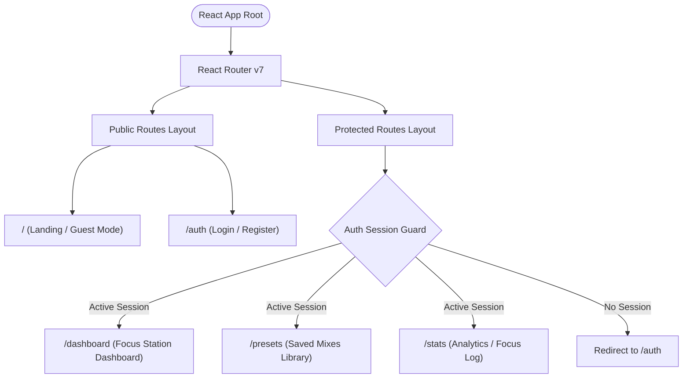

# 📐 VibeSpace Studio - Architecture Specification (ARCHITECTURE.md)

Tài liệu này đặc tả kiến trúc hệ thống, sơ đồ phân cấp component, luồng dữ liệu đồng bộ và cấu trúc thư mục của dự án **VibeSpace Studio**. Mọi AI Agent tham gia phát triển dự án cần tuân thủ nghiêm ngặt bản thiết kế này.

---

## 1. 🔀 Định tuyến & Kiến trúc Trang (Routing & Page Architecture)

Hệ thống định tuyến được quản lý bởi **React Router v7** với mô hình phân cấp gồm các route công khai (Public) và route được bảo vệ (Protected/Private).

### Sơ đồ Định tuyến & Bố cục (Mermaid Flow)


---

## 2. 🌲 Cấu trúc phân cấp Component (Component Hierarchy)

Cây phân cấp Component biểu diễn giao diện từ các khung chứa bố cục (Layouts) đến các thẻ tiện ích (Widgets) và thành phần nguyên tử (Atomic Elements).

```
App (Root)
│
├── 📦 PublicLayout
│   ├── 🌐 LandingPage / Guest Mode
│   │   ├── 🎥 VideoBackground (Dynamic Loop)
│   │   ├── 🎛️ AudioMixerWidget
│   │   │   └── 🎚️ AudioSlider (Uncontrolled HTML5 Audio)
│   │   ├── ⏱️ PomodoroTimerWidget
│   │   │   ├── ⏱️ VisualTimerDisplay
│   │   │   └── ⚙️ TimerSettingsModal
│   │   └── 💬 AuthTriggerBanner (Banner mời gọi đăng ký)
│   │
│   └── 🔐 AuthPage
│       └── 🔑 AuthCard (Login/Register Forms via Supabase Auth)
│
└── 📦 ProtectedLayout (Bọc bởi AuthGuard)
    ├── 🧭 GlobalSideNavigation (Thanh điều hướng bên mờ kính)
    │   └── 👤 UserProfileIndicator (Avatar, Tên, Logout trigger)
    │
    ├── 🎥 VideoBackground (Dynamic Loop - Tải từ cài đặt User Profile)
    │
    ├── 🌐 DashboardPage (Focus Station)
    │   ├── 🏛️ WidgetGrid (CSS Grid - Layout có thể cấu hình)
    │   │   ├── ⏱️ PomodoroTimerWidget
    │   │   │   ├── ⏱️ VisualTimerDisplay
    │   │   │   └── ⚙️ TimerSettingsModal
    │   │   ├── 📋 TodoListWidget
    │   │   │   ├── ➕ TaskInputField
    │   │   │   └── 📜 TaskListContainer
    │   │   │       └── 🏷️ TaskItem (Kéo thả, hoàn thành)
    │   │   └── ✍️ ZenNotepadWidget
    │   │       ├── 🏷️ EditorTitleBar
    │   │       ├── 📝 TextEditorArea (Textarea auto-resize)
    │   │       └── 💾 SyncIndicatorState (saved | saving | error)
    │   │
    │   └── 🎛️ FloatingControlBar
    │       ├── 🎧 AudioMixerPopover
    │       │   ├── 🎚️ AudioSlider
    │       │   └── 💾 SavePresetButton
    │       ├── 🎨 ThemeSelectorPopover (Đổi background video)
    │       └── ⚙️ LayoutConfigToggle (Ẩn/hiện các Widget)
    │
    ├── 🎨 PresetsPage (Saved Mixes)
    │   └── 🎴 PresetCardGrid
    │       └── 🎴 PresetCardItem (Play, Delete, Edit name)
    │
    └── 📊 StatsPage (Focus Log)
        ├── 📈 FocusTimeChart (Biểu đồ số giờ tập trung)
        └── 📜 PomodoroHistoryTable (Lịch sử hoàn thành)
```

---

## 3. 🗺️ Quy tắc Điều hướng & Bố cục (Navigation Rules)

Để tạo cảm giác đắm chìm (immersive experience), cấu trúc hiển thị của các thành phần điều hướng được tối giản tối đa:

| Trang (Route) | Header | Sidebar Navigation | Floating Controller | Trạng thái Background |
| :--- | :--- | :--- | :--- | :--- |
| **`/` (Guest Mode)** | ❌ Không hiển thị | ❌ Không hiển thị | ✔️ Hiển thị (Thu gọn ở góc) | Động (Mặc định: Cozy Room) |
| **`/auth`** | ❌ Không hiển thị | ❌ Không hiển thị | ❌ Không hiển thị | Tĩnh (Background tối mờ) |
| **`/dashboard`** | ❌ Không hiển thị | ✔️ Hiển thị (Tự ẩn/mờ) | ✔️ Hiển thị đầy đủ | Động (Theo cấu hình user) |
| **`/presets`** | ❌ Không hiển thị | ✔️ Hiển thị cố định | ❌ Không hiển thị | Tĩnh (Aesthetic Glassmorphism) |
| **`/stats`** | ❌ Không hiển thị | ✔️ Hiển thị cố định | ❌ Không hiển thị | Tĩnh (Aesthetic Glassmorphism) |

> [!TIP]
> **Quy tắc Zen Mode:** 
> Khi người dùng bấm nút **Zen Mode** trên Dashboard hoặc khi họ đang gõ chữ trong `ZenNotepadWidget`, toàn bộ Sidebar và Floating Controller phải tự động giảm độ mờ (opacity) xuống `10%` hoặc ẩn hoàn toàn sau 3 giây để người dùng chỉ tập trung vào nội dung công việc. Khi rê chuột hoặc nhấn phím Esc, các thanh điều hướng này sẽ hiển thị trở lại.

---

## 4. 🔄 Luồng đồng bộ hóa dữ liệu (State & Data Synchronization Flow)

Hệ thống quản lý trạng thái chia sẻ giữa bộ nhớ Client (Zustand), bộ nhớ đệm (localStorage) và Lưu trữ đám mây (Supabase) theo luồng tuần tự sau.

### Sơ đồ Luồng Đồng Bộ (State Synchronizer)

```mermaid
sequenceDiagram
    autonumber
    actor User as Người dùng
    participant UI as Giao diện React
    participant Store as Zustand (Global Store)
    participant Local as Local Storage
    participant DB as Supabase PostgreSQL

    User->>UI: Thay đổi (VD: Cập nhật ghi chú, tick hoàn thành task)
    UI->>Store: Gọi Action cập nhật State
    Store-->>UI: Rerender thành phần UI tương ứng (Optimistic Update)
    Store->>Local: Backup giá trị mới nhất (Đề phòng mất kết nối đột ngột)
    
    rect rgb(30, 41, 59)
        Note over Store, DB: Sync Service với Debounce 2 giây
        Store->>DB: Thực hiện UPSERT / UPDATE (Async Background Task)
    end
    
    alt Thành công (HTTP 200)
        DB-->>Store: Trả về trạng thái Saved thành công
        Store->>UI: Cập nhật Sync Indicator sang 'saved' (màu xanh lá)
    else Thất bại (Mất mạng / Lỗi DB)
        DB-->>Store: Báo lỗi kết nối
        Store->>UI: Cập nhật Sync Indicator sang 'error' (màu đỏ)
        Store->>Store: Rollback state từ Local Storage
    end
```


### Phân bổ Dữ liệu Lưu trữ
*   **Supabase PostgreSQL (Bảo lưu lâu dài)**:
    *   Bảng `profiles`: Cấu hình nền động (`current_theme`), ẩn/hiện widget (`layout_preferences`).
    *   Bảng `tasks`: Danh sách đầu việc Todo.
    *   Bảng `notes`: Nội dung văn bản Zen Notepad (giới hạn 1 bản duy nhất cho 1 người dùng để tránh lạm dụng băng thông).
    *   Bảng `audio_presets`: Tên preset và bộ cấu hình âm lượng.
    *   Bảng `pomodoro_sessions`: Nhật ký hoàn thành Pomodoro.
*   **Zustand (State động khi chạy)**: Trạng thái đếm ngược của đồng hồ Pomodoro (phút, giây, chạy/tạm dừng) và đối tượng mixer hiện tại.
*   **Local Storage (Draft & Offline Backup)**: Trình sao lưu tạm thời cho Notepad và Task trong lúc người dùng offline hoặc chưa đăng nhập.

---

## 5. 📂 Cấu trúc thư mục dự kiến (Folder Structure)

Dự án được cấu trúc theo cấu trúc Module hóa giúp dễ mở rộng và cô lập mã nguồn:

```
vibe-space/
├── 📁 .github/                   # Cấu hình GitHub Actions CI/CD
├── 📁 supabase/                  # Các file cấu hình migrations & seed SQL
├── 📁 public/                    # Assets tĩnh (video nền, tệp âm thanh ambient mặc định)
└── 📁 src/
    ├── 📁 assets/                # Hình ảnh, font chữ nội bộ
    ├── 📁 components/            # Shared UI Components (Nút bấm, Input, Modal dùng chung)
    │   ├── 📁 ui/                # Shadcn/ui or Custom Primitive Elements (Button, Popover, Dialog)
    │   └── 📁 widgets/           # Các widget cốt lõi của Dashboard
    │       ├── 📄 AudioMixer.tsx
    │       ├── 📄 PomodoroTimer.tsx
    │       ├── 📄 TodoList.tsx
    │       └── 📄 ZenNotepad.tsx
    ├── 📁 hooks/                 # Custom React Hooks
    │   ├── 📄 useAutosaveNote.ts
    │   ├── 📄 useLocalStorage.ts
    │   └── 📄 usePomodoro.ts
    ├── 📁 layouts/               # Layout templates (PublicLayout, ProtectedLayout)
    │   ├── 📄 PublicLayout.tsx
    │   └── 📄 ProtectedLayout.tsx
    ├── 📁 lib/                   # Khởi tạo các thư viện bên thứ ba (Supabase Client, v.v.)
    │   └── 📄 supabaseClient.ts
    ├── 📁 pages/                 # Các Page components chính (Routing targets)
    │   ├── 📄 AuthPage.tsx
    │   ├── 📄 DashboardPage.tsx
    │   ├── 📄 LandingPage.tsx
    │   └── 📄 PresetsPage.tsx
    ├── 📁 services/              # Các Business Logic Services độc lập
    │   └── 📄 AudioManager.ts    # Singleton Audio Class
    ├── 📁 store/                 # Zustand Stores (global state management)
    │   ├── 📄 useAudioStore.ts
    │   ├── 📄 useLayoutStore.ts
    │   └── 📄 useUserStore.ts
    ├── 📁 types/                 # TypeScript type definitions chung
    │   └── 📄 database.types.ts
    ├── 📁 utils/                 # Các hàm Helper tiện ích (định dạng thời gian, debounce)
    │   └── 📄 helpers.ts
    ├── 📄 App.tsx                # File định tuyến chính
    ├── 📄 index.css              # File CSS chứa cấu hình design tokens và hiệu ứng
    └── 📄 main.tsx               # Điểm khởi động ứng dụng
```

---

> [!WARNING]
> **Quy tắc về CSS Styling:**
> 1. Không viết CSS tùy chỉnh ad-hoc trong file `.css` trừ khi bắt buộc đối với các hoạt ảnh chuyển động phức tạp. Sử dụng Tailwind classes chuẩn.
> 2. Luôn áp dụng hiệu ứng **Glassmorphism** thống nhất: thẻ div sử dụng class `bg-white/5 backdrop-blur-md border border-white/10 shadow-2xl`.
