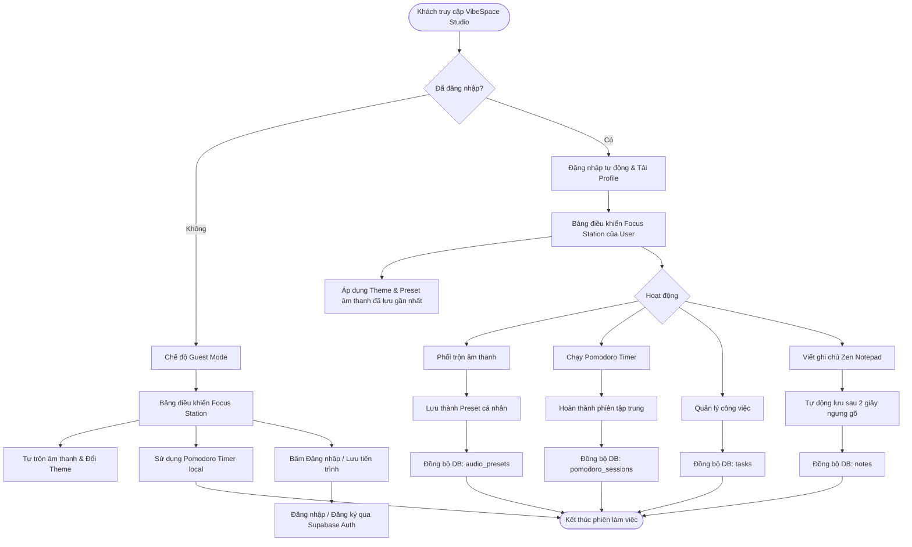

# 🌌 VibeSpace Studio - Product Requirement Document (PRD)

---

## 1. 🎯 Tổng quan & Mục tiêu sản phẩm (Overview & Product Goals)

### 1.1. Bối cảnh (Context)
Trong kỷ nguyên làm việc từ xa (remote work) và số hóa, việc duy trì sự tập trung cao độ trong môi trường đầy rẫy sự xao nhãng (mạng xã hội, thông báo tin nhắn, email) đang trở thành một thách thức lớn. Các nhóm người dùng sáng tạo và kỹ thuật như **Lập trình viên, Nhà thiết kế, Nhà văn, và Học sinh** liên tục phải đối mặt với trạng thái căng thẳng (burnout) và mất tập trung. 

Các giải pháp hiện tại thường rời rạc: một ứng dụng để nghe nhạc lofi, một ứng dụng Pomodoro riêng biệt, một ứng dụng ghi chú khác, và giao diện thường đơn điệu, thiếu tính tương tác trực quan hoặc cá nhân hóa thẩm mỹ.

### 1.2. VibeSpace Studio là gì?
**VibeSpace Studio** là một **Focus Station** (Không gian làm việc và âm thanh chữa lành cá nhân hóa) trên nền tảng web. Sản phẩm kết hợp hài hòa giữa **âm thanh môi trường (Ambient Sound Engine)**, **giao diện động trực quan (Visual Themes)** và các **công cụ tăng năng suất (Productivity Widgets)** thành một không gian ảo đồng nhất, yên tĩnh và đậm chất thẩm mỹ (aesthetic).

```
+-------------------------------------------------------------+
|                      VibeSpace Studio                       |
|  +----------------+  +------------------+  +-------------+  |
|  | Ambient Sound  |  |  Visual Themes   |  | Productivity|  |
|  |  Mixer Engine  |  | (Dynamic Spaces) |  |   Widgets   |  |
|  +--------+-------+  +--------+---------+  +------+------+  |
|           |                   |                   |         |
|           +-------------------+-------------------+         |
|                               |                             |
|                    👉 Personal Flow State                  |
+-------------------------------------------------------------+
```

### 1.3. Mục tiêu chiến lược (Product Goals)
*   **Trải nghiệm Tức thì & Cảm xúc (Vibe first):** Người dùng được "wow" ngay từ giây đầu tiên truy cập bởi thiết kế tinh tế, chuyển động mượt mà và âm thanh êm dịu.
*   **Kích thích trạng thái "Flow State":** Giúp người dùng nhanh chóng đi vào trạng thái tập trung sâu (deep work) thông qua cá nhân hóa âm thanh và thị giác.
*   **Tất cả trong một (All-in-one focus hub):** Tích hợp đầy đủ các công cụ thiết yếu (Timer, Todo, Notes) mà không cần chuyển đổi qua lại giữa các tab/ứng dụng, giảm thiểu tối đa điểm gây xao nhãng.
*   **Đồng bộ đám mây liền mạch (Sync & Save):** Cho phép lưu trữ các cấu hình không gian yêu thích (Preset mixes, Backgrounds) và tiến độ công việc thông qua tài khoản cá nhân.

---

## 2. 👥 Đối tượng người dùng mục tiêu (User Personas)

Dưới đây là chân dung 4 nhóm người dùng cốt lõi của VibeSpace Studio:

| Persona | Vai trò | Nhu cầu cốt lõi (Core Needs) | Điểm đau (Pain Points) | Kỳ vọng ở VibeSpace Studio |
| :--- | :--- | :--- | :--- | :--- |
| **Minh (26t)** | 💻 Lập trình viên Backend | Tiếng ồn trắng che lấp tạp âm văn phòng; giao diện tối (Dark Mode) dịu mắt khi code đêm. | Dễ bị xao nhãng bởi Slack, Telegram, tiếng ồn xung quanh. | Âm thanh Binaural/Brown noise chất lượng cao, Widget Pomodoro để kiểm soát thời gian code. |
| **Linh (24t)** | 🎨 UI/UX Designer | Không gian thị giác sáng tạo, truyền cảm hứng; âm nhạc lofi nhẹ nhàng để vẽ layout. | Căng thẳng vì màn hình làm việc quá đơn điệu, khô khan. | Các hình nền động nghệ thuật (Cozy Room, Rainy Window), khả năng tùy chỉnh màu sắc chủ đạo theo tâm trạng. |
| **Nam (30t)** | ✍️ Nhà văn tự do | Không gian tối giản cực độ (Zen mode), âm thanh gõ bàn phím cơ/máy đánh chữ giả lập. | Khó bắt đầu viết (Writer's block) và dễ mất tập trung bởi các tab trình duyệt. | Trình ghi chú tối giản (Zen Notepad) toàn màn hình kết hợp âm thanh phím cơ cơ học chân thực. |
| **Vy (19t)** | 📚 Sinh viên Đại học | Quản lý lịch học, ôn thi căng thẳng; âm thanh quán cà phê/thư viện để học bài. | Trì hoãn (procrastination), mất động lực khi học một mình. | Công cụ đếm ngược Pomodoro có âm báo dịu nhẹ, danh sách Todo phân loại bài tập rõ ràng. |

---

## 3. 🛠️ Phân rã tính năng MVP vs Nice-to-have

Để đảm bảo sản phẩm ra mắt nhanh chóng nhưng vẫn giữ vững chất lượng cao, các tính năng được phân rã theo ma trận ưu tiên dưới đây:

### 3.1. Tính năng lõi (MVP - Độ ưu tiên cao nhất)

#### 🎧 Ambient Sound Engine (Bộ trộn âm thanh)
*   Hỗ trợ nhiều nguồn âm thanh chất lượng cao: Tiếng mưa rơi (Rain), sấm sét (Thunder), tiếng gió rừng (Wind), tiếng sóng biển (Waves), tiếng quán cà phê (Coffee Shop), tiếng lửa trại (Campfire), và các loại sóng não/tiếng ồn (White, Pink, Brown Noise).
*   Thanh trượt chỉnh âm lượng độc lập cho từng nguồn âm thanh để tự phối ghép bản mix riêng.
*   Tính năng lưu trữ bản mix (Preset Mixer) để mở lại nhanh trong các lần truy cập sau.

#### 🖼️ Dynamic Visual Themes (Không gian thị giác động)
*   Hình nền video lặp (seamless loop) chất lượng cao hoặc hoạt ảnh CSS/Canvas nghệ thuật (VD: Căn phòng Lofi đêm mưa, Quán cà phê chiều hoàng hôn, Vũ trụ yên bình).
*   Chế độ làm mờ/mờ đục background để tập trung tối đa vào nội dung widget.
*   Hiệu ứng Glassmorphism (kính mờ) đồng bộ trên toàn bộ thẻ giao diện.

#### ⏱️ Productivity Widgets (Tiện ích tăng năng suất)
*   **Pomodoro Focus Timer:** Cho phép cấu hình thời gian Focus, Short Break, Long Break. Có thông báo âm thanh dễ chịu (Bell/Chime) khi hết giờ.
*   **Aesthetic Todo List:** Danh sách công việc cần làm đơn giản, hỗ trợ kéo thả sắp xếp thứ tự ưu tiên, đánh dấu hoàn thành kèm hiệu ứng âm thanh nhỏ chúc mừng.
*   **Zen Notepad:** Trình viết ghi chú tối giản hỗ trợ Auto-save (lưu tự động), chế độ Focus (ẩn tất cả thành phần xung quanh khi đang gõ).

#### 🔐 User Auth & Cloud Sync (BaaS Supabase)
*   Đăng ký/Đăng nhập bằng Email và mạng xã hội (Google).
*   Đồng bộ cấu hình không gian làm việc (Theme hiện tại, Preset âm thanh đang bật).
*   Đồng bộ danh sách Todo và nội dung Zen Notepad lên đám mây thời gian thực.

---

### 3.2. Tính năng nâng cao (Nice-to-have - Phát triển sau)

```
+-----------------------------------------------------------------------+
|                       Nice-to-have Features                           |
|                                                                       |
| 🎵 Spotify/YT Integration    👥 Co-focus Rooms    📊 Focus Analytics   |
| (Widget nghe nhạc bên thứ 3)  (Học tập chung ảo)  (Biểu đồ năng suất)  |
+-----------------------------------------------------------------------+
```

*   **Tích hợp Spotify/YouTube SDK:** Widget cho phép người dùng đăng nhập tài khoản Spotify hoặc dán link YouTube để phát nhạc trực tiếp trên dashboard của VibeSpace.
*   **Co-working Space (Phòng tập trung ảo):** Cho phép tạo phòng học/làm việc chung nhóm (Co-focus rooms) hiển thị avatar động của nhau, cùng đếm ngược chung một đồng hồ Pomodoro.
*   **Focus Analytics & Gamification:** Biểu đồ thống kê số phút tập trung hàng ngày/hàng tuần. Tích lũy điểm để "nuôi" cây ảo hoặc mở khóa thêm các hình nền, âm thanh độc quyền.
*   **Sound Healing AI:** Đề xuất tự động bản mix âm thanh dựa trên trạng thái tâm trạng đầu vào (Mood input check-in) của người dùng hoặc thời gian trong ngày.

---

## 4. 🔄 Sơ đồ luồng đi của người dùng (User Flow)

Dưới đây là sơ đồ luồng trải nghiệm của người dùng từ khi bắt đầu đến khi thực hiện các hoạt động tập trung trên hệ thống:



---

> [!NOTE]
> **Điểm cốt lõi của trải nghiệm người dùng (UX):** 
> Ứng dụng phải hoạt động ở chế độ *Guest Mode* ngay lập tức khi truy cập mà không bắt buộc đăng nhập. Dữ liệu của khách vãng lai sẽ được lưu tạm thời vào `localStorage`. Khi họ quyết định đăng ký tài khoản, toàn bộ dữ liệu tạm thời này sẽ được đồng bộ ngược lên Supabase database.

> [!WARNING]
> **Về tài nguyên đa phương tiện (Media Assets):**
> Tất cả các tệp âm thanh ambient và video nền động cần được tối ưu hóa dung lượng (âm thanh dạng `.ogg` hoặc `.mp3` 128kbps, video nền dạng `.webm` hoặc `.mp4` nén sâu, tối đa 5-8MB) và lưu trữ trên CDN hoặc Supabase Storage để đảm bảo tốc độ tải trang dưới 1.5 giây.
