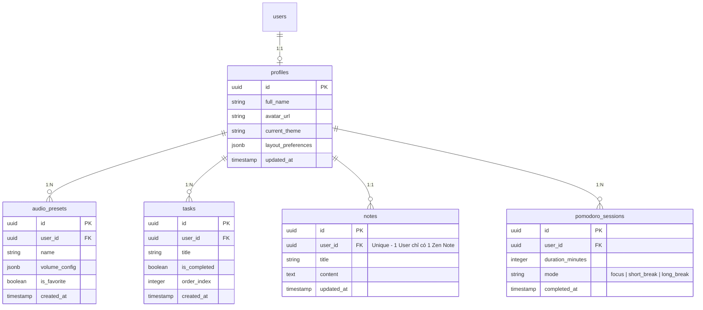

# 🛠️ VibeSpace Studio - Technical Specifications (Tech Specs)

---

## 1. 📂 Cấu trúc định tuyến (Routing Architecture)

Dự án sử dụng **Vite + ReactJS + TypeScript** làm nền tảng client, kết hợp với **React Router** để quản lý trạng thái định tuyến.

### 1.1. Bản đồ định tuyến (Route Mapping)

```
/ (Root Layout)
│
├── 📂 Public Routes (Không yêu cầu đăng nhập)
│   ├── /                 --> Landing Page & Guest Mode Dashboard (Focus Station)
│   └── /auth             --> Đăng nhập / Đăng ký / Quên mật khẩu
│
└── 📂 Protected Routes (Yêu cầu đăng nhập thông qua Supabase Session Guard)
    ├── /dashboard        --> Dashboard cá nhân (Đồng bộ hóa dữ liệu đám mây)
    ├── /presets          --> Thư viện lưu trữ các bản phối âm thanh cá nhân
    └── /stats            --> Thống kê thời gian tập trung (Nice-to-have)
```

### 1.2. Sơ đồ cấu trúc Component định tuyến
```
[App Router]
   │
   ├── [PublicLayout]
   │     ├── LandingPage (Guest Dashboard)
   │     └── AuthPage (Login/Register)
   │
   └── [ProtectedLayout]  <-- AuthGuard (Kiểm tra session từ Supabase)
         └── DashboardPage (User Focus Station)
```

### 1.3. Cấu hình Route Guard mẫu (TypeScript)
Để bảo vệ các route nhạy cảm, một `ProtectedRoute` component sẽ bọc lấy các trang yêu cầu quyền truy cập:

```typescript
import React, { useEffect, useState } from 'react';
import { Navigate, Outlet } from 'react-router-dom';
import { supabase } from '../lib/supabaseClient';

export const AuthGuard: React.FC = () => {
  const [loading, setLoading] = useState(true);
  const [authenticated, setAuthenticated] = useState(false);

  useEffect(() => {
    supabase.auth.getSession().then(({ data: { session } }) => {
      setAuthenticated(!!session);
      setLoading(false);
    });

    const { data: { subscription } } = supabase.auth.onAuthStateChange((_event, session) => {
      setAuthenticated(!!session);
      setLoading(false);
    });

    return () => subscription.unsubscribe();
  }, []);

  if (loading) {
    return (
      <div className="flex h-screen w-screen items-center justify-center bg-space-dark">
        <div className="h-10 w-10 animate-spin rounded-full border-4 border-t-accent" />
      </div>
    );
  }

  return authenticated ? <Outlet /> : <Navigate to="/auth" replace />;
};
```

---

## 2. 🗄️ Lược đồ cơ sở dữ liệu (Database Schema) & Types

Cơ sở dữ liệu được xây dựng trên **Supabase PostgreSQL**. Toàn bộ cấu trúc bảng sẽ đi kèm với chính sách RLS (Row Level Security) để bảo vệ dữ liệu người dùng ở mức độ cao nhất.

### 2.1. Lược đồ quan hệ thực thể (ERD - Mermaid)


### 2.2. SQL DDL (Supabase Schema Definition)

```sql
-- 1. Bảng Profiles (Liên kết với bảng auth.users của Supabase)
CREATE TABLE public.profiles (
    id UUID REFERENCES auth.users ON DELETE CASCADE PRIMARY KEY,
    full_name TEXT,
    avatar_url TEXT,
    current_theme TEXT DEFAULT 'cozy-room',
    layout_preferences JSONB DEFAULT '{"show_todo": true, "show_notes": true, "show_timer": true}'::jsonb,
    updated_at TIMESTAMP WITH TIME ZONE DEFAULT timezone('utc'::text, now()) NOT NULL
);

ALTER TABLE public.profiles ENABLE ROW LEVEL SECURITY;

CREATE POLICY "Cho phép người dùng xem profile cá nhân" ON public.profiles
    FOR SELECT USING (auth.uid() = id);

CREATE POLICY "Cho phép người dùng cập nhật profile cá nhân" ON public.profiles
    FOR UPDATE USING (auth.uid() = id);

-- Trigger tự động tạo profile khi user đăng ký qua Supabase Auth
CREATE OR REPLACE FUNCTION public.handle_new_user()
RETURNS TRIGGER AS $$
BEGIN
    INSERT INTO public.profiles (id, full_name, avatar_url)
    VALUES (new.id, new.raw_user_meta_data->>'full_name', new.raw_user_meta_data->>'avatar_url');
    RETURN NEW;
END;
$$ LANGUAGE plpgsql SECURITY DEFINER;

CREATE TRIGGER on_auth_user_created
    AFTER INSERT ON auth.users
    FOR EACH ROW EXECUTE FUNCTION public.handle_new_user();

-- 2. Bảng Audio Presets (Các bản phối âm thanh cá nhân)
CREATE TABLE public.audio_presets (
    id UUID DEFAULT gen_random_uuid() PRIMARY KEY,
    user_id UUID REFERENCES public.profiles(id) ON DELETE CASCADE NOT NULL,
    name TEXT NOT NULL,
    volume_config JSONB NOT NULL, -- Cấu trúc: {"rain": 0.5, "lofi": 0.8, "coffee": 0.0}
    is_favorite BOOLEAN DEFAULT false,
    created_at TIMESTAMP WITH TIME ZONE DEFAULT timezone('utc'::text, now()) NOT NULL
);

ALTER TABLE public.audio_presets ENABLE ROW LEVEL SECURITY;

CREATE POLICY "Users có thể tương tác toàn quyền với preset của chính họ" ON public.audio_presets
    FOR ALL USING (auth.uid() = user_id);

-- 3. Bảng Tasks (Danh sách Todo)
CREATE TABLE public.tasks (
    id UUID DEFAULT gen_random_uuid() PRIMARY KEY,
    user_id UUID REFERENCES public.profiles(id) ON DELETE CASCADE NOT NULL,
    title TEXT NOT NULL,
    is_completed BOOLEAN DEFAULT false NOT NULL,
    order_index INTEGER DEFAULT 0 NOT NULL,
    created_at TIMESTAMP WITH TIME ZONE DEFAULT timezone('utc'::text, now()) NOT NULL
);

ALTER TABLE public.tasks ENABLE ROW LEVEL SECURITY;

CREATE POLICY "Users có thể tương tác toàn quyền với tasks của chính họ" ON public.tasks
    FOR ALL USING (auth.uid() = user_id);

-- 4. Bảng Zen Notes (Lưu trữ ghi chú của User)
CREATE TABLE public.notes (
    id UUID DEFAULT gen_random_uuid() PRIMARY KEY,
    user_id UUID REFERENCES public.profiles(id) ON DELETE CASCADE UNIQUE NOT NULL,
    title TEXT DEFAULT 'Untitled Note',
    content TEXT DEFAULT '',
    updated_at TIMESTAMP WITH TIME ZONE DEFAULT timezone('utc'::text, now()) NOT NULL
);

ALTER TABLE public.notes ENABLE ROW LEVEL SECURITY;

CREATE POLICY "Users có thể tương tác toàn quyền với notes của chính họ" ON public.notes
    FOR ALL USING (auth.uid() = user_id);

-- 5. Bảng Pomodoro Sessions (Ghi nhận thời gian tập trung)
CREATE TABLE public.pomodoro_sessions (
    id UUID DEFAULT gen_random_uuid() PRIMARY KEY,
    user_id UUID REFERENCES public.profiles(id) ON DELETE CASCADE NOT NULL,
    duration_minutes INTEGER NOT NULL,
    mode TEXT CHECK (mode IN ('focus', 'short_break', 'long_break')) NOT NULL,
    completed_at TIMESTAMP WITH TIME ZONE DEFAULT timezone('utc'::text, now()) NOT NULL
);

ALTER TABLE public.pomodoro_sessions ENABLE ROW LEVEL SECURITY;

CREATE POLICY "Users có thể xem và ghi nhận phiên của chính họ" ON public.pomodoro_sessions
    FOR ALL USING (auth.uid() = user_id);
```

### 2.3. Client TypeScript Interfaces

```typescript
export interface Profile {
  id: string;
  full_name: string | null;
  avatar_url: string | null;
  current_theme: string;
  layout_preferences: {
    show_todo: boolean;
    show_notes: boolean;
    show_timer: boolean;
  };
  updated_at: string;
}

export interface VolumeConfig {
  [soundId: string]: number; // Ví dụ: { rain: 0.4, campfire: 0.1, white_noise: 0.0 }
}

export interface AudioPreset {
  id: string;
  user_id: string;
  name: string;
  volume_config: VolumeConfig;
  is_favorite: boolean;
  created_at: string;
}

export interface Task {
  id: string;
  user_id: string;
  title: string;
  is_completed: boolean;
  order_index: number;
  created_at: string;
}

export interface ZenNote {
  id: string;
  user_id: string;
  title: string;
  content: string;
  updated_at: string;
}

export interface PomodoroSession {
  id: string;
  user_id: string;
  duration_minutes: number;
  mode: 'focus' | 'short_break' | 'long_break';
  completed_at: string;
}
```

---

## 3. 🧠 Thách thức kỹ thuật lớn nhất & Giải pháp chi tiết

### 🔥 Thách thức 1: Quản lý Audio Engine chống Re-render & Rò rỉ bộ nhớ (Memory Leak)

#### 1. Vấn đề (Problem)
Khi người dùng phối nhiều âm thanh cùng lúc (VD: Rain + Campfire + Lofi), mỗi lần họ kéo thanh trượt (slider) điều chỉnh âm lượng, React state của volume thay đổi liên tục. Nếu lưu trữ các đối tượng `HTMLAudioElement` trực tiếp trong React state hoặc component local:
*   Mỗi lần điều chỉnh volume sẽ kích hoạt re-render toàn bộ widget chứa âm thanh đó, gây giật lag UI (đặc biệt khi kết hợp với video background động).
*   Nguy cơ rò rỉ bộ nhớ cao nếu Component unmount nhưng đối tượng phát audio chạy nền không được dọn dẹp (cleanup) và giải phóng.
*   Hiện tượng âm thanh bị ngắt quãng hoặc không đồng bộ do trình duyệt chặn chính sách tự động phát (Autoplay Policy).

#### 2. Giải pháp kỹ thuật (Solution)
Xây dựng một **Singleton Audio Manager** thuần (Vanilla JS/TS class) hoạt động độc lập ngoài React component tree. Trạng thái âm lượng được kiểm soát thông qua một Global Store (như **Zustand** kết hợp cơ chế `transient updates` hoặc sử dụng trực tiếp các tham chiếu `ref` để cập nhật trực tiếp thuộc tính `.volume` của thẻ Audio).

##### Cấu trúc AudioManager (Vanilla TypeScript)
```typescript
class AudioManager {
  private static instance: AudioManager;
  private audioElements: Map<string, HTMLAudioElement> = new Map();
  private initialized: boolean = false;

  private constructor() {}

  public static getInstance(): AudioManager {
    if (!AudioManager.instance) {
      AudioManager.instance = new AudioManager();
    }
    return AudioManager.instance;
  }

  // Khởi tạo các track âm thanh có sẵn
  public initTracks(tracks: { id: string; url: string }[]) {
    if (this.initialized) return;
    
    tracks.forEach(track => {
      const audio = new Audio(track.url);
      audio.loop = true;
      audio.volume = 0; // Bắt đầu ở chế độ câm
      // Tải trước siêu dữ liệu để tối ưu hóa thời gian phát
      audio.preload = 'auto';
      this.audioElements.set(track.id, audio);
    });
    
    this.initialized = true;
  }

  // Cập nhật âm lượng trực tiếp mà không kích hoạt React re-render
  public setVolume(id: string, volume: number) {
    const audio = this.audioElements.get(id);
    if (audio) {
      // Đảm bảo âm thanh phát nếu âm lượng > 0
      if (volume > 0 && audio.paused) {
        audio.play().catch(e => console.warn("Autoplay blocked or interupted:", e));
      } else if (volume === 0 && !audio.paused) {
        audio.pause();
      }
      audio.volume = volume;
    }
  }

  // Dọn dẹp tài nguyên khi logout hoặc đóng ứng dụng
  public cleanup() {
    this.audioElements.forEach(audio => {
      audio.pause();
      audio.src = '';
      audio.load();
    });
    this.audioElements.clear();
    this.initialized = false;
  }
}

export const audioManager = AudioManager.getInstance();
```

##### Tích hợp vào React Component sử dụng Uncontrolled Sliders
Để hạn chế re-render tối đa, ta cập nhật trực tiếp thuộc tính `volume` của `audioManager` từ sự kiện `onChange` mà không đưa nó vào React State chính.

```typescript
import React, { useEffect, useRef } from 'react';
import { audioManager } from '../services/AudioManager';

interface AudioSliderProps {
  trackId: string;
  trackUrl: string;
  initialVolume: number;
}

export const AudioSlider: React.FC<AudioSliderProps> = ({ trackId, trackUrl, initialVolume }) => {
  const sliderRef = useRef<HTMLInputElement>(null);

  useEffect(() => {
    // Khởi tạo track nếu chưa có
    audioManager.initTracks([{ id: trackId, url: trackUrl }]);
    
    // Set giá trị ban đầu
    if (sliderRef.current) {
      sliderRef.current.value = initialVolume.toString();
    }
    audioManager.setVolume(trackId, initialVolume);
  }, [trackId, trackUrl, initialVolume]);

  const handleVolumeChange = (e: React.ChangeEvent<HTMLInputElement>) => {
    const volume = parseFloat(e.target.value);
    audioManager.setVolume(trackId, volume);
    // Lưu cấu hình vào localStorage local để ghi nhớ tạm thời nhanh chóng
    localStorage.setItem(`vol_${trackId}`, volume.toString());
  };

  return (
    <div className="flex items-center gap-4 p-2 bg-white/5 backdrop-blur-md rounded-lg">
      <span className="text-white text-sm w-20 capitalize">{trackId}</span>
      <input
        ref={sliderRef}
        type="range"
        min="0"
        max="1"
        step="0.01"
        className="w-full h-1 bg-white/20 rounded-lg appearance-none cursor-pointer accent-accent"
        onChange={handleVolumeChange}
      />
    </div>
  );
};
```

---

### 🔥 Thách thức 2: Đồng bộ hóa trạng thái Zen Notepad thời gian thực & Chống xung đột dữ liệu (Debounced State Sync & Autosave)

#### 1. Vấn đề (Problem)
Zen Notepad tự động lưu văn bản. Nếu mỗi ký tự gõ phím được gửi trực tiếp lên database Supabase:
*   Tạo ra hàng trăm truy vấn SQL ghi (Write request) mỗi phút, gây lãng phí tài nguyên và chạm ngưỡng giới hạn (Rate limit) của Supabase.
*   Làm UI bị giật do chờ đợi phản hồi mạng (Network Roundtrip).
*   Gây ra tình trạng xung đột phiên bản (race condition) nếu người dùng gõ nhanh và kết nối mạng không ổn định.

#### 2. Giải pháp kỹ thuật (Solution)
Sử dụng mô hình **Local-First with Debounced Cloud Sync**. Toàn bộ quá trình gõ phím được lưu tức thời vào bộ nhớ cục bộ `React State` và `localStorage`. Một cơ chế trì hoãn (Debounce) 2 giây sẽ được thiết lập: chỉ khi người dùng ngừng gõ trong vòng 2 giây, dữ liệu mới được đẩy lên Supabase thông qua một API client không chặn.

```
[Người dùng gõ văn bản]
        │
        ▼ (Gõ liên tục)
[Cập nhật UI State cực nhanh] & [Lưu LocalStorage]
        │
        ▼ (Ngưng gõ trong 2 giây)
[Trigger Debounce Timer]
        │
        ▼ (Nếu timer hết hạn)
[Gửi yêu cầu PUT/UPSERT lên Supabase] ──► (Thành công) ──► [Hiển thị trạng thái "Đã lưu đám mây"]
```

##### Triển khai hook Custom `useAutosaveNote` (TypeScript)
```typescript
import { useState, useEffect, useCallback } from 'react';
import { supabase } from '../lib/supabaseClient';
import debounce from 'lodash/debounce';

interface UseAutosaveNoteProps {
  userId: string;
  initialContent: string;
  initialTitle: string;
}

export const useAutosaveNote = ({ userId, initialContent, initialTitle }: UseAutosaveNoteProps) => {
  const [content, setContent] = useState(initialContent);
  const [title, setTitle] = useState(initialTitle);
  const [syncStatus, setSyncStatus] = useState<'saved' | 'saving' | 'error'>('saved');

  // Hàm thực thi đồng bộ lên Supabase
  const syncToCloud = useCallback(
    debounce(async (updatedTitle: string, updatedContent: string) => {
      setSyncStatus('saving');
      try {
        const { error } = await supabase
          .from('notes')
          .upsert(
            {
              user_id: userId,
              title: updatedTitle,
              content: updatedContent,
              updated_at: new Date().toISOString(),
            },
            { onConflict: 'user_id' }
          );

        if (error) throw error;
        setSyncStatus('saved');
      } catch (err) {
        console.error('Lỗi đồng bộ ghi chú:', err);
        setSyncStatus('error');
      }
    }, 2000), // Trì hoãn 2000ms (2 giây) sau khi người dùng ngừng thao tác
    [userId]
  );

  // Trigger đồng bộ khi nội dung hoặc tiêu đề thay đổi
  const handleContentChange = (newContent: string) => {
    setContent(newContent);
    setSyncStatus('saving');
    // Lưu tạm vào localStorage phòng trường hợp mất mạng đột ngột
    localStorage.setItem(`note_draft_${userId}`, JSON.stringify({ title, content: newContent }));
    syncToCloud(title, newContent);
  };

  const handleTitleChange = (newTitle: string) => {
    setTitle(newTitle);
    setSyncStatus('saving');
    localStorage.setItem(`note_draft_${userId}`, JSON.stringify({ title: newTitle, content }));
    syncToCloud(newTitle, content);
  };

  return {
    title,
    content,
    syncStatus,
    handleContentChange,
    handleTitleChange,
  };
};
```

---

> [!IMPORTANT]
> **Hướng dẫn triển khai cho AI Coding Agent:**
> 1. Khi khởi chạy trang dashboard, hệ thống luôn ưu tiên tìm kiếm bản nháp trong `localStorage` trước. Nếu bản nháp local có trường `updated_at` mới hơn dữ liệu tải về từ Supabase, hệ thống phải nhắc người dùng chọn khôi phục bản nháp local hay tải đè dữ liệu cloud.
> 2. Mọi hoạt động của Audio Mixer phải hỗ trợ tương tác cảm ứng mượt mà trên thiết bị di động (hỗ trợ các sự kiện `onTouchStart` / `onTouchMove`).
